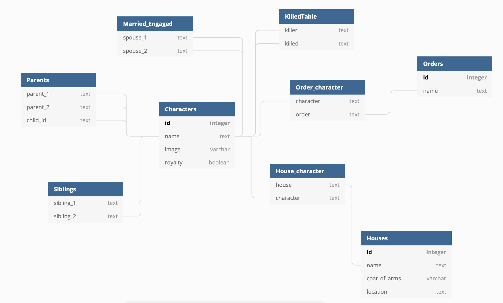

# Game of Thrones Back End Configuration

## Schema Design

>The Schema offers connections between a character to their family members, people they have killed, their order, and their houses.

## Data
Create and Seed table with Game of Throne data. Create orders and houses JSON to pull from and utilize Game of Thrones data from repository found online. 

## Routes
* GET **/GOT/characters**: Retrieve all character's names, houses, orders and images.
* GET **/GOT/houses**: Retrieve list of houses and list of characters in houses.
* GET **/GOT/orders**: Retrieve list of orders and list of characters in orders.
* GET **/GOT/tree/:charID**: Retrieve characters siblings, parents, and grandparents.
* GET **/GOT/duel**: Retrieve character's name, attack_value, and images.

## Testing
Test to ensure routes are working and returning data when called. 
